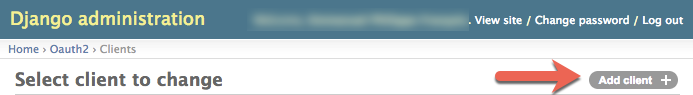
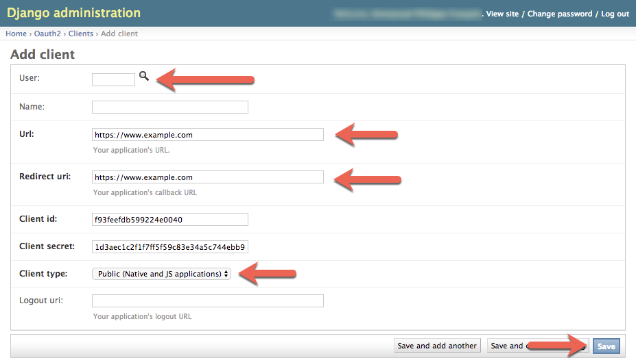
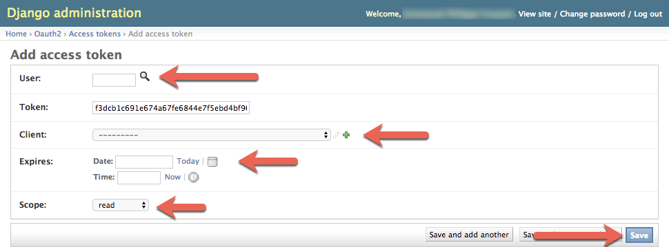

# How to use open edX enrollment APIs

## Background
This procedure is aimed at the Ginkgo release of open edX. It has not been tested with any other version.

## Steps to follow
### One time setup
* Create a service account to use to interact with open edX
  * Create a user
  * Create a OAUTH2 client
### Usage
* Get an access token
* Get information from the API
* Sample code

## One time setup
### Create a service account to use to interact with open edX
In order to use the APIs, you will need to have a regular user created on open edX. This user can be created by either go to the Django admin interface (`<lms_base_url>/admin/auth/user/`) or by creating it from a terminal on the server:
```shell
sudo su -s /bin/bash edxapp
cd
/edx/bin/python.edxapp /edx/bin/manage.edxapp lms manage_user <username> <email address> --staff --superuser --settings=aws
exit

sudo -u www-data /edx/bin/python.edxapp /edx/app/edxapp/edx-platform/manage.py lms changepassword <username> --settings aws
```

### Create a oauth2 client
This step can simply be performed by
* going to the Django admin (`<lms_base_url>/admin/oauth2/client`)
* Click on 'Add client'
  
* provide the required information and click on save
  
  !!! note
  don't forget to note down the the client_id and client_secret since you will need them afterwards
  !!!

## Usage
Using the APIs is a two steps process: getting an access token and using it to call the APIs. Ad minima, you'll need `curl` to make the calls.

### Getting an access token
This step can be performed either by the command line or via the django admin page. The django admin path may be recommended for two reasons:
* Better control of the expiration of the token
* No need to store the user credentials (aside from the token itself) into the source code

#### From the command line
This step can be performed by issuing the below command:
```shell
curl -X POST -d "client_id=<client_id>&client_secret=<client_secret>&grant_type=password&username=<username>&password=<password>" <lms_base_url>/oauth2/access_token/
```

!!! note
Please note the trailing slash at the end of the url
!!!

This should return an access token you will re-use for the next call:
```json
{
  "access_token": "848c7513c82500c39975b75e73d42953af036ecf", 
  "token_type": "Bearer", 
  "expires_in": 2591999, 
  "scope": ""
}
```

#### from django admin
* go to `<lms_base_url>/admin/oauth2/accesstoken/add/`
* Provide the required information and click on 'save':
  

### Using the API
Once you have the access token, you can use the API:
```shell
curl -v -X GET -H "Authorization: Bearer <access_token>" -H "Content-Type: application/json" <lms_base_url>/api/enrollment/v1/enrollment
```

!!! note
Please note the **absence** of trailing space at the end of the url
!!!

## Sample code to use the API

### Code
```python
import requests
import json

lms_base_url = ""  # e.g. http://edx.org
client_id = ""  # e.g. 123456
client_secret = ""  # e.g. 123456
username = ""  # e.g. admin
password = ""  # e.g. secret

token_endpoint = "{}/oauth2/access_token/".format(lms_base_url)
token_request_data = {'client_id': client_id,
                      'client_secret': client_secret,
                      'grant_type': 'password',
                      'username': username,
                      'password': password}

token_request = requests.post(token_endpoint, data=token_request_data)
if token_request.status_code == 200:
    token_request_response = json.loads(token_request.text)
    access_token = token_request_response['access_token']

    enrollment_endpoint = "{}/api/enrollment/v1/enrollment".format(lms_base_url)
    enrollment_request_headers = {'Authorization': "Bearer {}".format(access_token),
                                  'Content-Type': 'application/json'}
    enrollment_request = requests.get(enrollment_endpoint, headers=enrollment_request_headers)
    if enrollment_request.status_code == 200:
        courses = json.loads(enrollment_request.text)
        print json.dumps(courses, sort_keys=True, indent=4, separators=(',', ': '))
```

### Using the GitHub repository's code
* clone this repository locally
  ```shell
  git clone https://github.com/jaepetto/POC_edX_APIs.git
  ```
  
* go to the checked out code
  ```shell
  cd POC_edX_APIs
  ```
  
* create a virtual environment
  ```shell
  virtualenv .venv
  ```

* Activate the virtual environment
  ```shell
  source .venv/bin/activate
  ```
  
* Install the depedencies
  ```shell
  pip -r requirements.txt
  ```

* Update the configuration values in the `POC_edX_APIs.py`
* Run the code
  ```shell
  python POC_edX_APIs.py
  ```